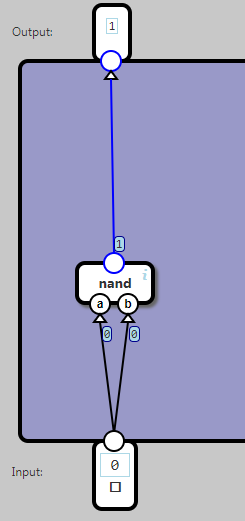

## Invert

The first task is to build an inverter (inv) component.

An inv-component has a single input and a single output.

The output should be the opposite of the input, so 0 for 1 and vice versa.

Components are typically specified with a table showing inputs and outputs, like this:

	Input	Output
	  0	      1
	  1	      0

## The Nand gate

The only component available in the first level is the nand gate. The nand gate is a fundamental building block which all other components can be built from.

A nand gate has two inputs and one output, and the specification is like this:

	Input	Output
	a	b	
	0	0	  1
	1	0	  1
	0	1	  1
	1	1	  0

## Answer

