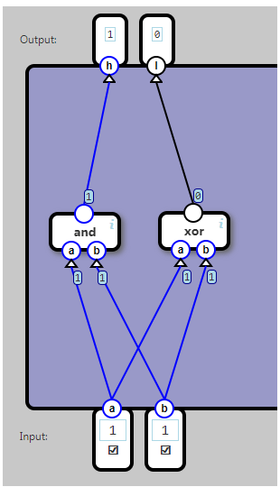

## Half Adder

An add component which adds two bits. The output is a two-bit value.

The h output is the high bit, the l is the low bit.

	Input		Output
	a	b		h	l
	0	0		0	0
	0	1		0	1
	1	0		0	1
	1	1		1	0

