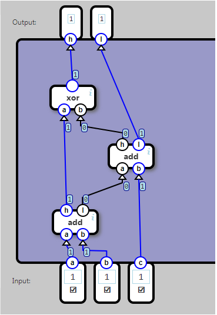

## Full Adder

An add component which adds three bits: a, b, and c.

The output is a two-bit value. The houtput is the high bit, the l is the low bit.

	Input			Output
	a	b	c		h	l
	0	0	0		0	0
	0	0	1		0	1
	0	1	0		0	1
	0	1	1		1	0
	1	0	0		0	1
	1	0	1		1	0
	1	1	0		1	0
	1	1	1		1	1

