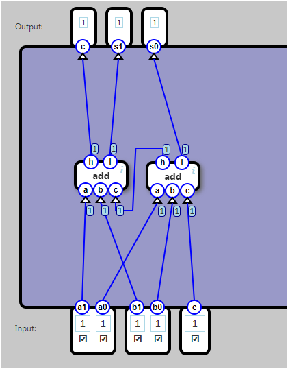

## Multi-bit Adder

Build an adder which adds two 2-bit numbers and a 1-bit carry.

### Input

a1 a0 is a 2-bit number.

b1 b0 is a 2-bit number.

c (input carry) is a 1-bit number.

### Output

The sum of the input numbers as the 3-bit number c s1 s0 where c is the high bit.

### Example

		Input					  Output
	a1	a0	b1	b0	c			c	s1	s0
	1	0	1	0	1			1	0	1	2+2+1=5

