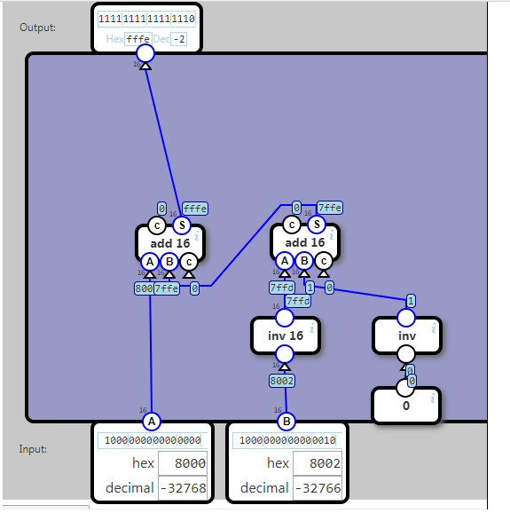

## Subtraction

Outputs A minus B as a 16-bit number.

If the result is less than zero it is represented as 65536 plus the result.

Examples:

	result	16 bit binary	unsigned decimal
	 1		0000000000000001	1
	 0		0000000000000000	0
	-1		1111111111111111	65535
	-2		1111111111111110	65534
	-3		1111111111111101	65533

(This is equivalent to two's complement representation)

