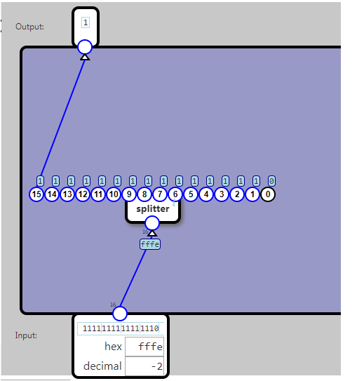

## Less than Zero

Outputs 1 if the input as a 16-bit number is negative

Specification:

	Input			Output
	input >= 0	      0
	input < 0		  1

A number is considered less than zero if bit 15 is 1.
Bit numbering

Bits are numbered from right to left, starting with 0 as the rightmost bit. So bit 15 is the leftmost bit in a 16-bit word.

