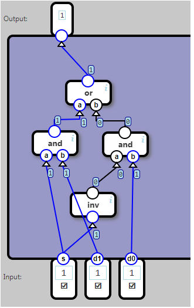

## Selector

A select-component selects one out of two input bits for output.

The s (select) bit indicates which input is selected: If 0, d0 is selected, if 1, d1is selected.

	   Input		  Output
	s	d1	d0	
	0	0	0			0
	0	1	0			0
	0	0	1			1
	0	1	1			1
	1	0	0			0
	1	0	1			0
	1	1	0			1
	1	1	1			1

X = (（S非）与(D0) )  或 （S 与 D1）

也就是说，S为0时，只关心D0；S为1时，只关心D1；然后将两种情况“合并”起来（“或”操作）。

