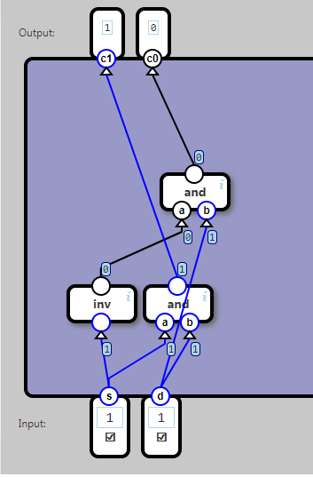

## Switch

A switch component channels a data bit through one of two output channels.

s (selector) determines if the d (data) bit is dispatched through c1 or c0.
	
	Input		Output
	s	d		c1	c0
	0	0		0	0
	0	1		0	1
	1	0		0	0
	1	1		1	0

