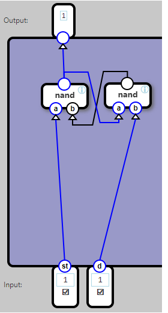
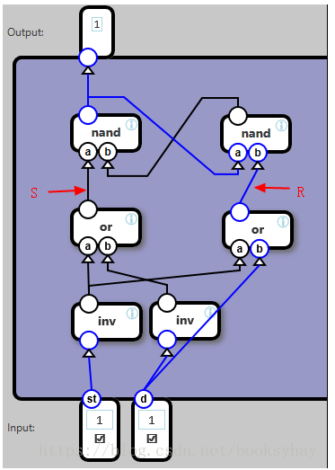
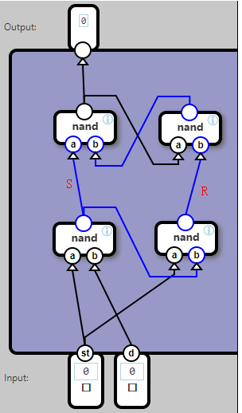
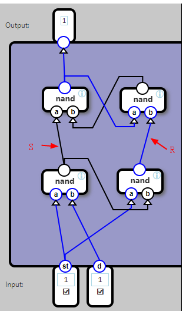

## Latch

A latch component stores and outputs a single bit

When st (store) is 1, the value on d is stored and emitted.

When st is 0, the value of d is ignored, and the previously stored value is still emitted.

To describe this in an input/output table, we introduce a variable, out, which can be assigned a bit value and keep it:

	Input		Effect				Output
	st	d		
	1	0		set out to 0		out
	1	1		set out to 1		![out
	0	1		-	out
	0	0		-	out

第二个任务是，创建一个锁存器Latch
输入：存储使能端st(Store），数据端d

输出：X

逻辑：当ST=1时，X=D；当ST=0时，X不变。即，存储使能ST有效时，输入端D的信号会送到锁存器存起来，并输出。当存储使能端ST无效时，将不再接收输入，输出端仍然保持之前的输入。

分析：

首先要使用RS触发器。这是一种带反馈的组合电路。

这种电路的特点：

当ST为1，D为0时，输出X一定为0；

当ST为0，D为1时，输出X一定为1；

当ST为1 ，D为1时，输出X的状态是不确定的，有可能为0，也有可能为1，取决于上一次的状态。或者说，ST=1，并且D=1时，输出不变。如果在此之前是ST=1，D=0（此时输出X=0），然后D由0变为1，X保持不变，输出还是0.反过来，如果在此之前是ST=0，D=1（此时输出为1），然后ST由0变为1，X也保持不变，输出还是1.

当ST为0，D为0时，输出X也是1。但是这种状态不重要。因为：如果把右边的与非门的输出记为Y，则前面三种情况下，X和Y刚好是相反的，但这种情况下X和Y都是1。

情况1：ST=1，D=0时，X=0，Y=1；

情况2：ST=0，D=1时，X=1，Y=0；

情况3：ST=1，D=1时，X和Y保持不变。

情况4：ST=0，D=0时，X=1，Y=1。

为了方便，把输出X所对应的输入端ST称为S（Set），另一个控制端为R（Reset）。当R和S不一样时，R负责清零（Reset），S负责置位（Set）。R和S都为1时，输出不变。R和S都为0时，没有什么用，可以忽略。

小结：RS触发器的特点是：
S=1，R=0时，X=0；

S=0，R=1时，X=1；

S=1，R=1时，X不变；

S=0，R=0时，（X=Y=1）避免出现。

 

有了以上基础，要实现锁存器，可以这样做：

ST=0时，让R和S都变为1；

ST=1时，R和S取反，并且D=R。

最终结果为：

或者使用与非门来实现ST=0时R和S都为1的目标：

当ST为1时，R和S取决于D：R=D（R等于D非再非），S=D非。

