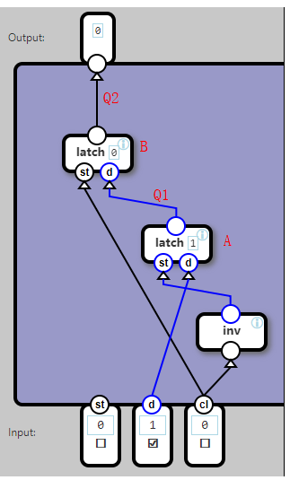
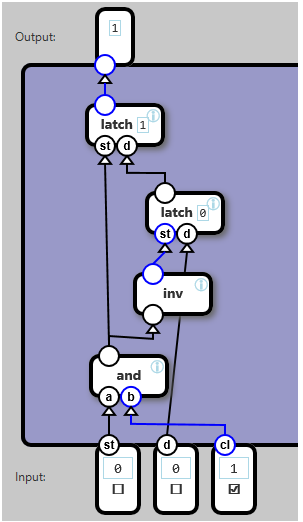

## Data Flip-Flop

A DFF (Data Flip-Flop) component stores and outputs a bit, but only change the output when the clock signal change from 0 to 1.

When st (store) is 1 and cl (clock signal) is 0 the value on d is stored. But the previous value is still emitted.

When the clock signal changes to 1, the flip-flop starts emitting the new value.

When st is 0, the value of d does not have any effect.

When cl is 1, the value of st and ddoes not have any effect.

To describe this in a table requres two variables, in and out:

	   Input		Effect				   Output
	st	d	cl		
	1	0	0	 set in to 0				out
	1	1	0	 set in to 1				out
	0	-	0	     -						out
	-	-	1	 set out to in				out

上一个任务中的锁存器是高电平使能的，只有ST为高，就会一直更新数据D，容易产生竞争条件。实际应用中，需要将锁存条件由电平改为边沿（即边沿触发）。比如上升沿触发，即只有在ST由0变为1的那个时刻，才会更新数据D到锁存器中；平时不管ST是0，还是1，数据都会被锁在锁存器中，不会变化。

任务说明：

这是一个带使能端的上升测D触发器。

 

原材料：

基本的门电路（与，或，非，与非，异或），再加上锁存器

分析：

先不考虑使能端，可以用2个高电平使能的锁存器来实现边沿触发。

当CL为0时，由于非门的作用，A锁存器的ST为1，此时将D锁到A中，Q1=D；此时B锁存器的ST为0，Q2不变。

当CL为1时，A锁存器使能端无效，Q1数据不变；此时B锁存器有效，Q2=Q1=之前的D。实现了锁存器的输出。这个时候，D无论怎么变化，也不会影响Q1和Q2。

 

加上ST使能端后：

