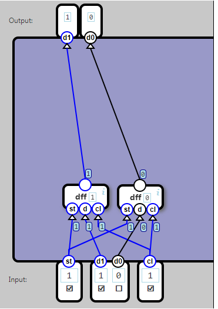

## Register

A 2-bit DFF component works like a data flip-flop, except two bits (d1 and d0) are stored and emitted instead of one.

任务四：组建寄存器。

有了边沿触发的D寄存器，就可以组成多位的寄存器了。

这个任务很简单，只需要做一个两位的寄存器。使用两个D触发器即可

