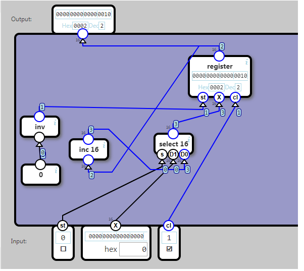
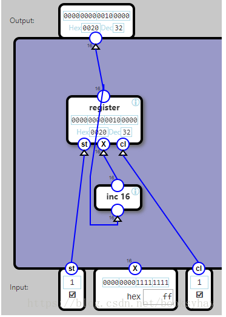
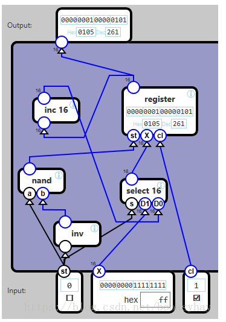

## Counter

A counter component increments a number each clock cycle.

The counter coutput changes when cl(clock signal) changes to 1.

If st is 0, then the previous counter value is incremented with 1.

If st (store) is 1, then the input value Xis used as the new counter value.

To describe this in a table requres two variables, in and out, which stores 16-bit numbers:

	Input				Effect				Output
	st	cl		
	0	0			set in to out + 1		out
	1	0			set in to X				out
	-	1			set out to in			out

任务五：带加载功能的计数器。

逻辑：

当加载使能端ST为1时，输出Y为输入X，即加载预定义值X。

当加载使能端ST为0时，每个CL脉冲将使得输出Y加一。

 

分析：

先不考虑加载功能，只实现一个计数器。使用一个寄存器(register)和一个自加器(inc 16)就可以了。

每个时钟脉冲使得register读入自加器inc16之后的结果，再送到自加器。

考虑加载功能，只需要用一个select16，当ST为0时，从自加器的输出取值；当ST为1时，从X取值。

图中的nand和inv是为了生成一个“1”使能位。

这个软件的下一版更新时，应该在原材料中增加常量“0”和“1”。