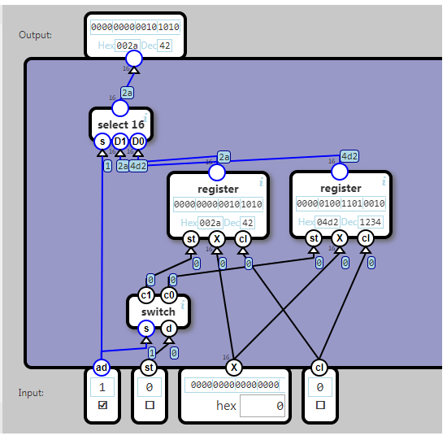

## RAM

Build a memory unit with two 16-bit registers which is addressable and writable using a one-bit address.

## Input

ad (address) indicate which storage unit we are accessing.

st (store) indicate if we want to write to the unit.

+ If 1, the value on X is stored in the unit.
+ If 0, then X is ignored.

X (data) is a 16-bit value.

cl (clock signal) synchronizes state changes. X is stored when cl=0, but emitted only when cl changes to 1.

## Output

The value currently stored in the unit addressed by ad.

## Desc
说明：就是通过一个地址位（AD）和一个switch开关（译码器），可以选择使用哪一片寄存器（register）。这样就可以扩展出更大容量的寄存器组。并且可以通过地址来确定访问哪一片寄存器。

RAM本意是：随机访问存储器。“随机”的意思是，只要知道地址，就可以直接访问，不需要像磁带机那样等半天去寻址。“访问”的含义包括“读”和“写”。对之对应的是ROM，是随机只读存储器。

