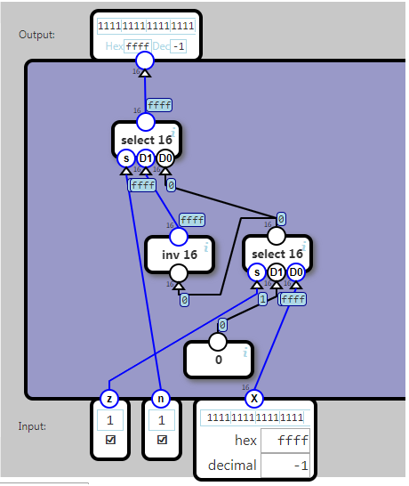
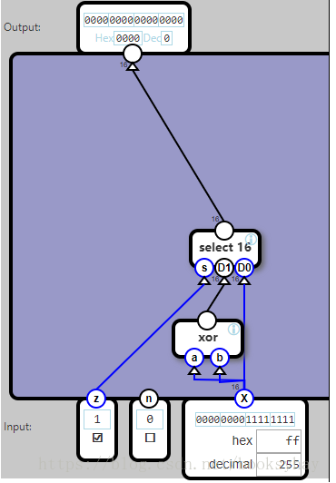
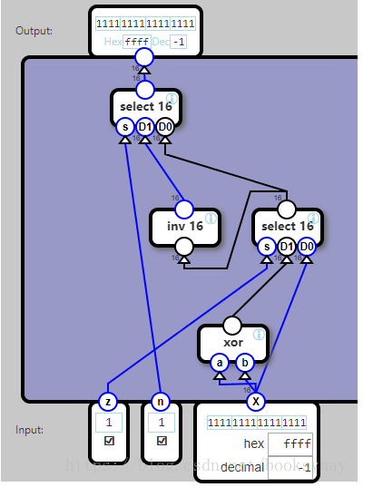

## Unary ALU

A Unary ALU modifies a single input X. Two flags select which operations to apply.

If z (zero) is 1, then 0 is output instead of the input

If n (negate) is 1, then the input is inverted

The order is significant, so if both are 1, the output will be the inversion of 0.

Specification:
	
	Input		   Output
	z	n		
	0	0		X unmodified
	1	0		0
	0	1		Invert X
	1	1		Invert 0

## 分析

ALU是算术逻辑单元，是执行最基本的算术运算和逻辑运算的单元。

本任务目标：根据输入标志来执行不同的运算。

输入：Z（清零）、N（取反）、X（16位数据）

输出：Y（16位数据）

逻辑：

当Z标志为1时，输出结果为0；

当N标志为1时，输出结果要对X按位取反。

当Z标志和N标志都为1时，输出结果为对0按位取反。

当Z和N标志都不为1时，输出结果Y=X。

原材料：基本的门电路（与，或，与非，异或）、16位反向器、16位选择器。

分析：

这个运算过程分两步，第一步是先决定输出0，还是输出X。

使用一个16位选择器，S端接Z标志。

图中的异或门是为了产生“0”常量。当Z为0时，Y=X；当Z=1时，Y=0。
第二步，再对该结果取反。使用一个选择器，决定是输出刚才的结果，还是取反后的结果。

