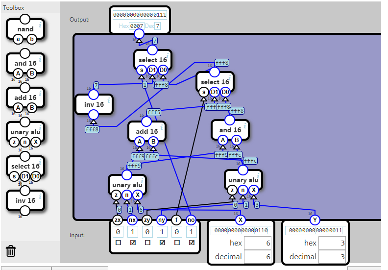

## ALU

The ALU (Artihmetic/Logic Unit) performs one or more operations on two input values X and Y.

The six flags selects what operations to perform. Each flag trigger an operation when the flag is 1:

- zx: Use 0 for X
- nx: Invert X
- zy: Use 0 for Y
- ny: Invert Y
- f selects an operation:
	- 0: output is X AND Y 
	- 1: output is X + Y
- no: Invert output

The flags can be combined and the specified order is significant.

For example if both zx and nx is 1, then X is inverted 0.

输入：A，B

控制端：ZX，NX，ZY，NY：控制X和Y的运算是清零还是取反；

控制端F：是输出X与Y，还是输出X+Y；其中X和Y是前两个模块的运算结果，是个中间变量。

控制端NO：输出取反。

输出：Z

