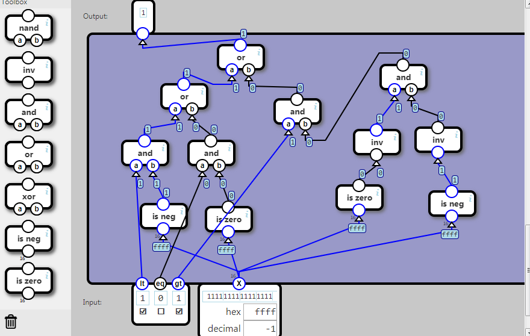

## Condition

The three flags indicate three possible conditions for the number X:

	Flag	Condition
	lt		Less than zero
	eq		Equal to zero
	gt		Greater than zero

If the flag for the true condition is 1, then the output is 1.

The flags can be combined so:

		Flags			Output 1 when
	lt	eq	gt	
	0	0	0			Never
	0	0	1			X > 0
	0	1	0			X = 0
	0	1	1			X ≥ 0
	1	0	0			X < 0
	1	0	1			X ≠ 0
	1	1	0			X ≤ 0
	1	1	1			Always

任务说明：

三个标志组合成8种情况。

当标志位为001时，代表“是否大于”。如果此时X>0，则输出为1.

当标志位为010时，代表“是否等于”。如果此时X=0，则输出为1.

其他情况类似。

当标志位为000时，不管X是什么，输出都为0；

当标志位为111时，不管X是什么，输出都为1.

 

原材料：除了基本的门之外，还有两个子部件：“是否为0”、“是否为负数”。

