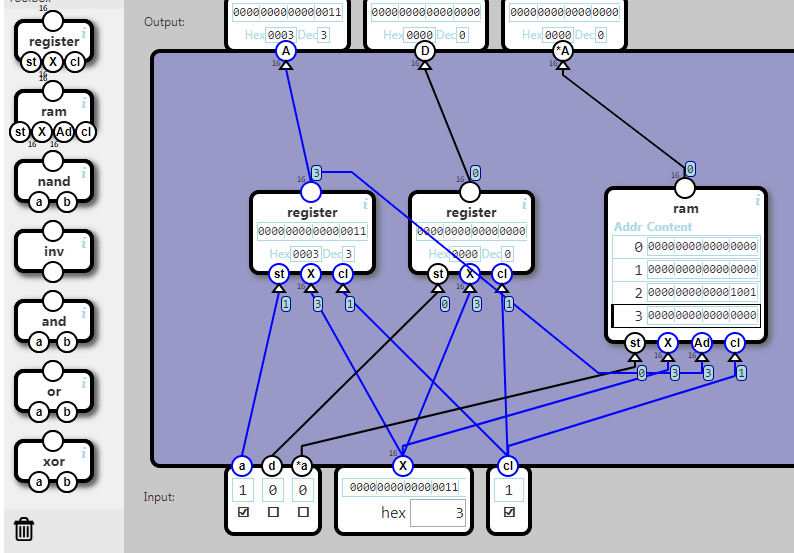

## Combined Memory

The memory of the processor consist of two 16-bit registers called A and D, and a RAM unit.

The a, d, *a flags and the X input is used to update one or more of the registers.

	Flag	
	a	Write X to the A register
	d	Write X to the D register
	*a	Write X to RAM at the address given by the A register

The flags can be combined, so X is simultaneously written to multiple registers. If all three flags are 0, the X input is ignored.

cl is the clock signal.

	Output	
	A	The current value of the A register
	D	The current value of the D register
	*A	The current value in RAM at the address given by A the register

