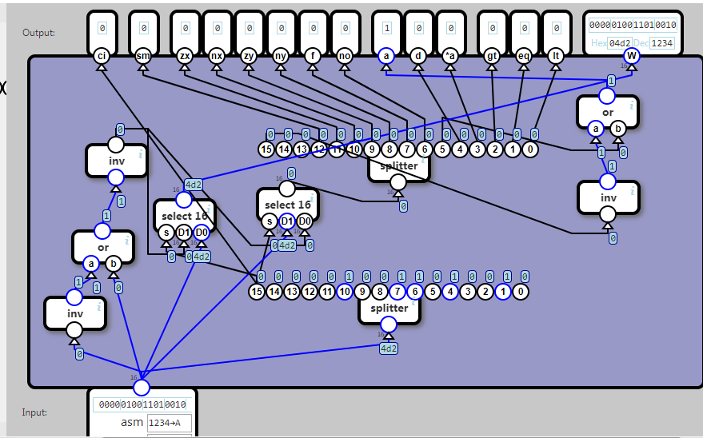

## Instruction Decoder

Bit 15 of the input indicates the kind of instruction:

	bit 15	Instruction kind
	0		data
	1		computation

For a data instruction, W (data word) should reflect the input, the a flag should be 1 and all other flags should be 0.

For a computation instruction, the ci(computation instruction) flag should be 1, W should be 0. All other flags should be mapped from the bits in the input as follows:

	Input	Output	
	Bit		Group	flag
	14		(ignored)	-
	13		(ignored)	-
	12		source	sm
	11		computation	zx
	10		computation	nx
	9		computation	zy
	8		computation	ny
	7		computation	f
	6		computation	no
	5		destination	a
	4		destination	d
	3		destination	*a
	2		condition	gt
	1		condition	eq
	0		condition	lt

