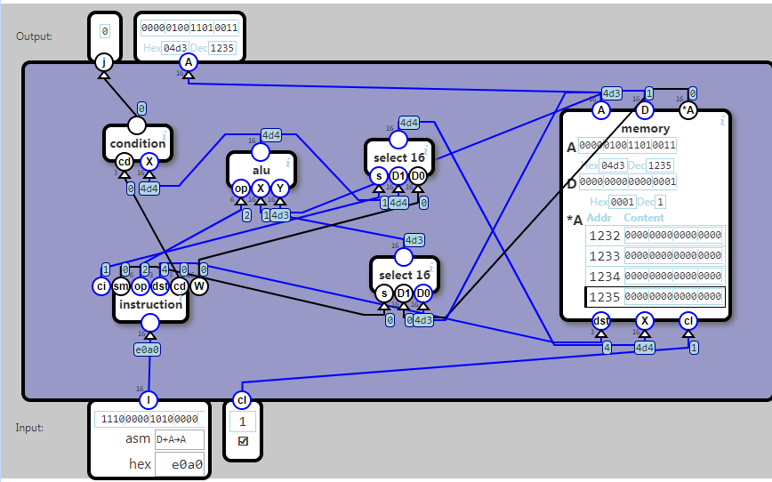

## Control Unit

Input

I is an instruction that should be decoded and executed

cl is the clock signal.

Operation

Should execute the ALU operation given by the op flags.

- The X input to the ALU is the D register.
- The Y input depends on the sm(source memory) flag:

	   	sm		Y
	    0		A register
	    1		*A (RAM)
	    

## Store

    
Should store a value in memory. Which value depends on the ci(computation instruction) flag:

	ci			Value to store
	0	The W (data word) from the instruction
	1	The output of the ALU operation

The value is stored in the memory units specified by the dst (destination) flags.

## Output

j indicates if the ALU output fulfills the condition flags specified by the cdflags.

A is the current value of the A register

