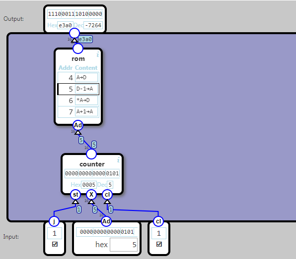

## Program Engine

The program engine consist of a ROM module holding the program, and a counter (called program counter or PC) that holds the address of the current instruction.

Input

- If j (jump) is 1, the counter is set to the number in Ad (address). 
- If j is 0, Ad is ignored.
 
cl is the clock signal.

Output

The instruction at the ROM address given by the counter

