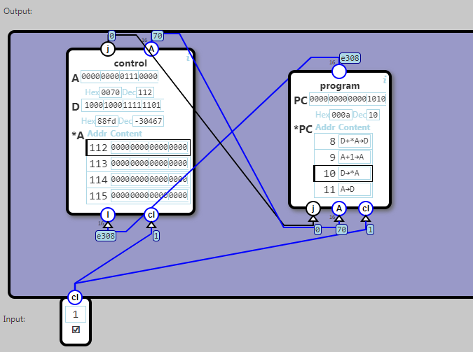

## Computer

Combine the program engine with the control unit.

The control unit should executed the instructions passed from the program engine. If the instruction result in a jump, the program counter should be updated to the new address.

cl is the clock signal

