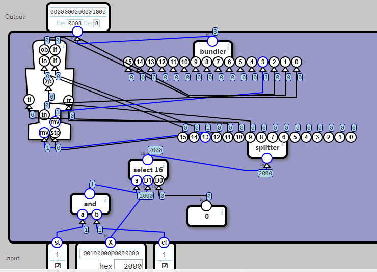

## Input and Output

Integrate with the robot hardware, so it can be written and read like a memory address.

Input signals should be be sent to the hardware when st (store) is 1 and cl(clock signal) is 1.

Output signals should be readable immediately

Mapping of input bits in X to device control signals:

	bit	Control signal
	15	lo
	14	lf
	13	mv
	12	stp
	11	tl
	10	tr
	09	zp

Mapping of device sensors to output bits:

	bit	Sensor output
	3	mv
	2	tn
	1	lf
	0	ob

